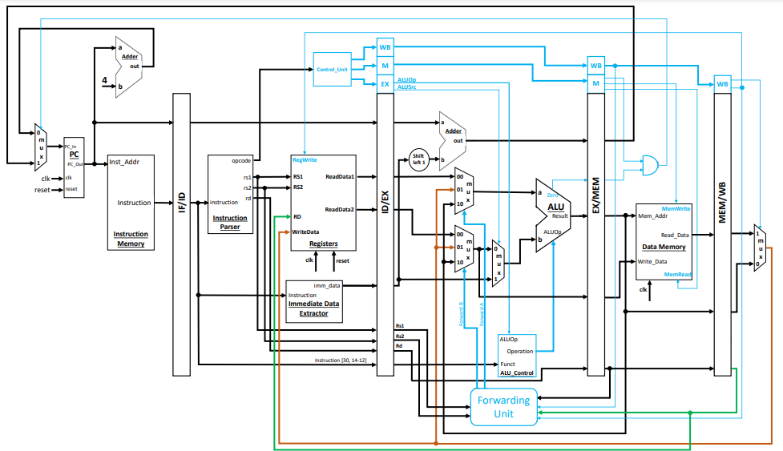

# CPU-211 Parallel Project

**Important Notice**  
This repository is for **educational purposes only**.  
**DO NOT COPY** this code for any assignments, labs, or coursework submissions.

Full credit is given to the amazing course instructor **Dr. Tor Aamodt** and the teaching staff.  
Special thanks to the professor — CPEN 211 is truly the **funnest course I’ve taken**.

---

## Contents
- `Verilog_Code/Tests/` → Assembly and test cases  
- `Verilog_Code/main/` → Main modules, controller, PC, checkers, and supporting blocks  
- `MODELSIM/` → Simulation project (may need to be recompiled)  
- `QUARTUS/` → FPGA project (may need to be recompiled)  
- `Documents/` → Documentation regarding the labs

---

## Reference CPU
Modeled after the following CPU (image) :

---

Enjoy exploring the design!
